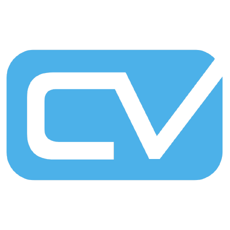
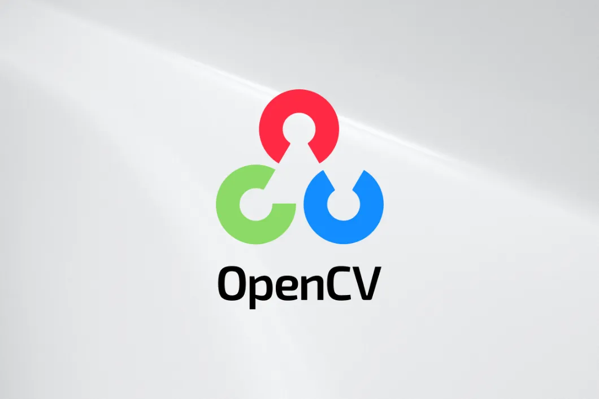
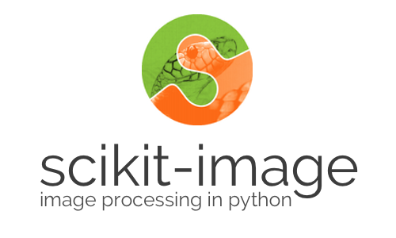

## What you will learn in this repository? 📚

Welcome to a captivating journey into the world of computer vision and image processing! 🌌 Explore a rich collection of classes and functions that blend the power of OpenCV, scikit-image, MediaPipe, and cvzone libraries. Gain expertise in image manipulation, feature extraction, object detection, facial recognition, and more. Dive into practical examples and hands-on projects to build advanced computer vision applications, honing your skills in this dynamic field! 💡

## How to use this library? 🛠️

Get started in three simple steps:
1. 📥 Pull the custom library onto your PC by cloning or downloading it.
2. ➕ Create your custom file with the functions or classes you want to add or modify.
3. 📜 Import your custom file into the project, benefiting from the combined power of the library and your own additions!

## Resources 📚

1. OpenCV: [Documentation](https://docs.opencv.org/4.x/d9/df8/tutorial_root.html)
2. Scikit-image: [Documentation](https://scikit-image.org/docs/stable/)
3. CVZone: [Website](https://www.computervision.zone/)
4. MediaPipe: [GitHub](https://github.com/google/mediapipe)

## The author of this repository: Kaizen Team! 👥

